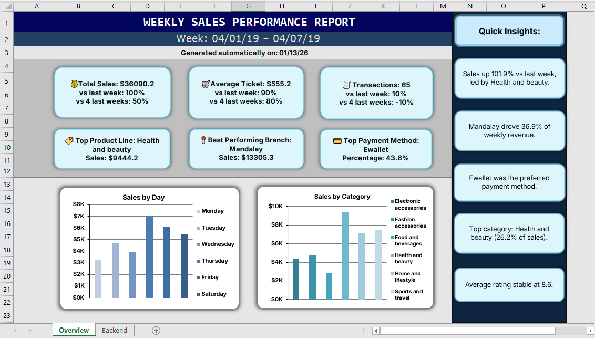
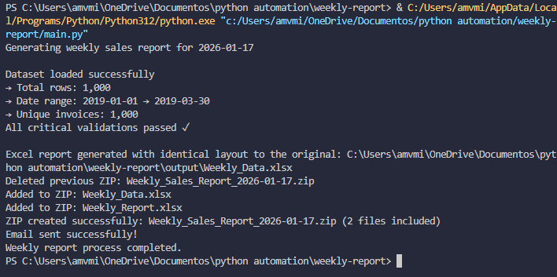

# Weekly Sales Report — Automated Generator

In today's competitive retail landscape, managers face delays and errors when manually preparing weekly sales reports from raw transaction data — slowing down responses to trends, promotions, and performance issues.

This end-to-end automated pipeline eliminates that pain: it validates incoming CSVs, computes reliable KPIs with historical comparisons, assembles clean tables, populates professional Excel templates, bundles them into dated ZIP archives, and can email the package directly to stakeholders.

## Overview

An end-to-end Python pipeline that loads supermarket sales CSVs, runs comprehensive validation and consistency checks, computes weekly KPIs, assembles presentation-ready tables, writes a styled Excel workbook, bundles outputs into a dated ZIP, and can email the ZIP to stakeholders.

This project uses a **hybrid reporting approach**: Python handles the heavy computational logic and data validation, while a pre-designed Excel template handles the professional visual presentation and natural language summaries.

This project is portfolio-ready and demonstrates practical skills in data engineering, analytics, reporting automation, and operational delivery.

---

## Project Gallery

**Executive Report Preview**
*The final report featuring professional formatting and automated insights generated via the Python-to-Excel pipeline.*




**Automation Logic**
*The script processing data, validating records, and generating the reporting package.*


---

## Table of Contents
- [Overview](#overview)
- [Architecture & Design](#architecture--design)
- [Features](#features)
- [Repository Structure](#repository-structure)
- [Prerequisites](#prerequisites)
- [Installation](#installation)
- [Configuration](#configuration)
- [Usage](#usage)
- [Input / Output](#input--output)
- [Validation & Assumptions](#validation--assumptions)
- [Troubleshooting](#troubleshooting)

## Architecture & Design

The system follows a **"Data-to-Presentation"** workflow to ensure maintainability:
1.  **Data Processing:** Python validates raw CSV data and calculates complex KPIs (Period-over-Period changes, 4-week averages).
2.  **Structured Export:** Cleaned metrics are exported to a dedicated `Weekly_Data.xlsx` file (the "Engine").
3.  **Dynamic Template:** A master **Excel Template** (`Weekly_Report.xlsx`) uses dynamic references to the data file. This allows for professional-grade formatting, custom dashboards, and insights that are presentation-ready for executive review.


## Features
- **Robust Ingestion:** CSV validation with clear error/warning messages.
- **KPI Computation:** Total sales, transactions, average ticket, rating, gross income, quantity, and period-over-period comparisons.
- **Hybrid Reporting:** Combines Python’s computational power with the formatting flexibility of Excel templates.
- **Deterministic Output:** Precise table placement using OpenPyXL to ensure data matches the template structure.
- **Automated Delivery:** ZIP packaging and optional SMTP-based email delivery of the generated report.

## Repository Structure

- `main.py` — Main orchestration script that runs the whole pipeline.
- `config.py` — Central configuration and file-path helpers.
- `requirements.txt` — Python dependencies.
- `data/` — Input CSVs (e.g., `data/sales.csv`).
- `output/` — Generated Excel file (`Weekly_Data.xlsx`), the template file (`Weekly_Report.xlsx`) and ZIP archive.
- `images/` — Screenshots for documentation.
- `src/` — Core modules:
    - `src/data.py` — Loader and validation.
    - `src/date_utils.py` — Reporting window helpers.
    - `src/metrics.py` — KPI and percentage-change calculations.
    - `src/tables.py` — Builds ordered DataFrame tables.
    - `src/excel_report.py` — Writes and styles Excel workbook.
    - `src/zip_handler.py` — ZIP creation helper.
    - `src/email_handler.py` — Email sender via SMTP.

## Prerequisites
- Python 3.10+
- Install packages from `requirements.txt`.

## Installation

```powershell
python -m venv .venv
.\.venv\Scripts\Activate.ps1

pip install -r requirements.txt
